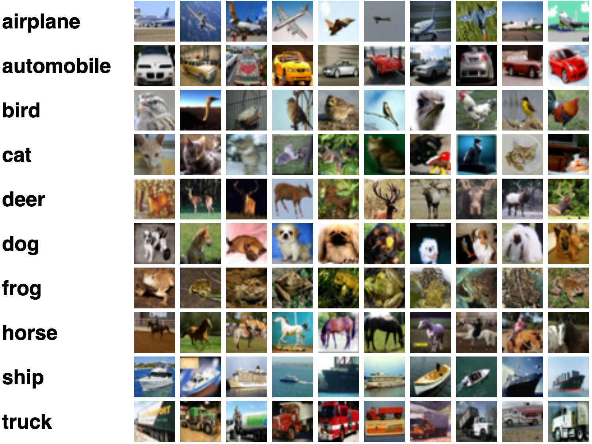
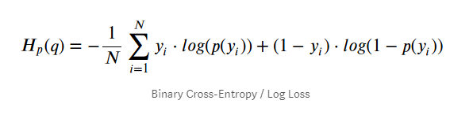
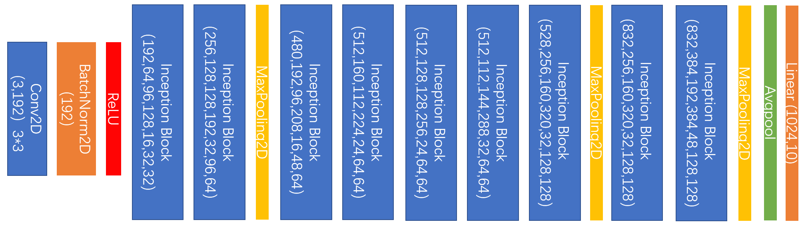
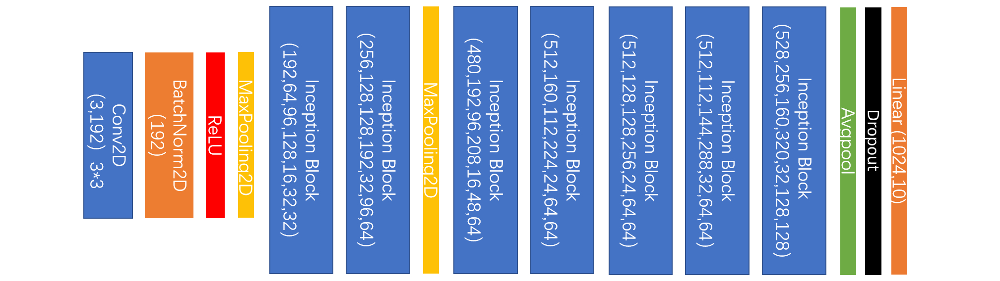
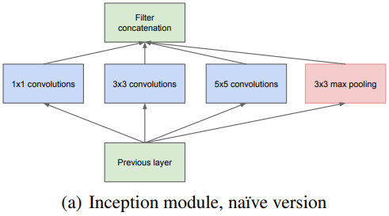
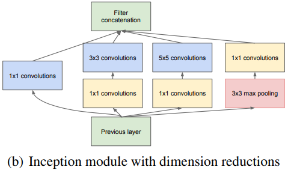
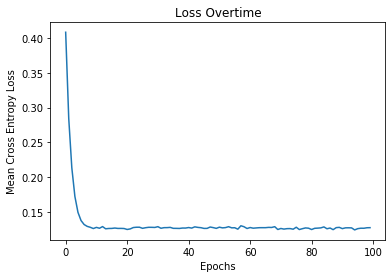
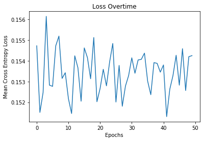

# Deep Neural Network Classifier for the CIFAR-10 dataset

Implementation of a DNN for classifying images in the CIFAR-10 dataset

## Data

We use the CIFAR-10 dataset:

## Preprocessing Data

We apply the following transformations to our training data:

-   Random Horizontal Flips

-   Normalization of the images to a `[-1,1]` range

### Optimizer used

ADAM Optimizer

#### Loss Function

## Neural Network

Our DNN is inspired by the Google Le Net architecture

We use a modified Google Le Net architecture

We use the `Inception` blocks from google in our network

|          Naive Block         |     Improved Block     |
| :--------------------------: | :--------------------: |
|  |  |

## Results

After 1500 epochs with the following hyper-parameters and repeated save and load trainings.

For the trained model, we achieve an accuracy of `84.3 %`

And when a new model is trained for 100 epochs only, we get a low accuracy of `9.4 %` that is no better than random guessing.

### Loss curve for training of 100 epochs on an untrained model

### Loss curve for an already converged model

## Acknowledgements

-   Learning Multiple Layers of Features from Tiny Images, Alex Krizhevsky, 2009.

-   Szegedy, Christian, Wei Liu, Yangqing Jia, Pierre Sermanet, Scott Reed, Dragomir Anguelov, Dumitru Erhan, Vincent Vanhoucke, and Andrew Rabinovich. “Going Deeper with Convolutions.” ArXiv:1409.4842 [Cs], September 16, 2014. <http://arxiv.org/abs/1409.4842>.
