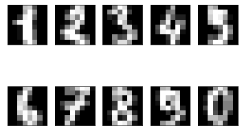
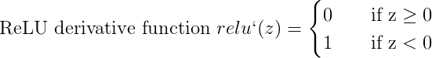
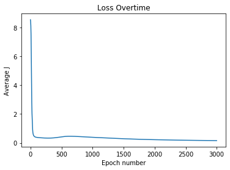
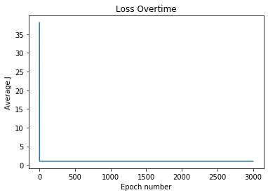
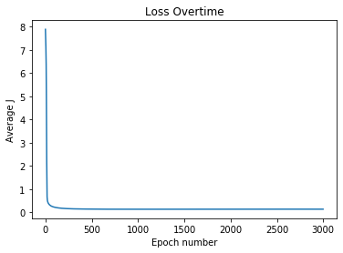
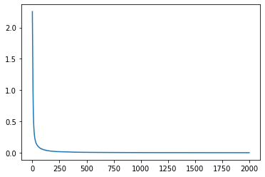

# Fully connected Neural Network with numpy

Implementation of a fully connected neural network from scratch in Python.

## Data

The data source used was the MNIST handwritten digit dataset.

## Preprocessing Data

The data present as `numpy.ndarray` must be standardized to zero mean and unit variance for faster training and to prevent problems with gradient vanishing or explosion.

## Activation functions used

## Results of training and testing with sklearn's train_test_split

**Note: All neural network models have a structure of [64, 30, 10] 64 input neurons, 30 hidden neurons and 10 output nerurons for digits from 0 to 9**

### Sigmoid Model

Accuracy = 95.54937%

### ReLU Model

Accuracy = 10.292072%

### Tanh Model

Accuracy = 97.079277%

We observe the highest accuracy for the [64, 30, 10] neurons model with the `tanh` activation function with prediction accuracy of `97.079277%` followed by the model with the `sigmoid` activation with accuracy of `95.54937%` and finally the model with the ReLU performed dreadfully, not learning the training set at all with an accuracy of a mere `10%`. ReLU might be performing poorly because ReLU activations should only be used for hidden layers and not all layers.

## Fully Connected Neural Network Implementation with PyTorch

With the Pytorch Implementation of the [64, 30, 10] structure, convergence is achieved very quickly with test set accuracy at 97.76%

