# Linear and Logistic regression model implementation

**Custom implementation of the univariate linear regression, linear logistic regression and polynomial logistic regression with regularization. Only the python `numpy` library is used along with `matplotlib` for plots in `jupyter notebook`.**

## Univariate linear regression

### Visualizing our first dataset.

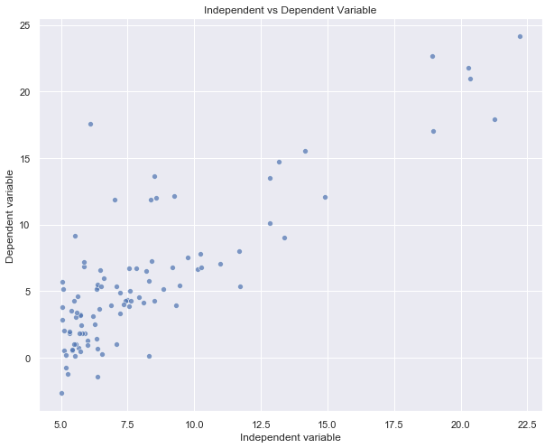

#### Hypothesis function

    Here, x<sub>0</sub> is always assumed to be 1

<br/>

    Vectorized hypothesis


#### Mean Squared Error Loss function

    Also known as the MSE cost function.
    The 1/2 constant term is used to make sure the derivative smoothly cancels out the 2 term.
    Adding any constants will not affect the final minimized value of the parameters.

<br/>

    Vectorized MSE Loss


#### Gradient descent

    The alpha term is the learning rate of the gradient descent.
    A larger alpha means larger steps at each gradient descent update but may lead to a divergence of the MSE loss.
    A very small alpha means the convergence will be inefficiently slow.

<br/>

    Vectorized gradient descent


#### Loss curve and final best fit line with Gradient descent

Loss curve plotted along with the final best fit line after running 10<sup>3</sup> iterations of the Gradient descent update equations.
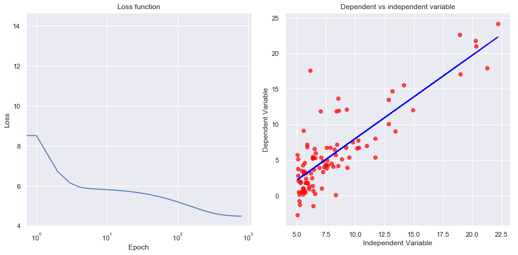

#### Final best fit line with Normal equations method

The final best fit line after the normal equations method.<br/>
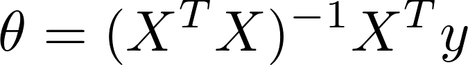

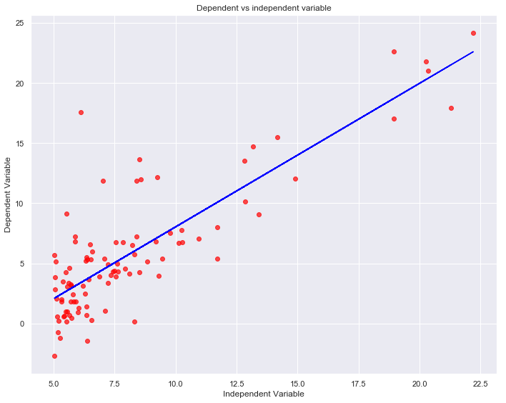

## Linear Logistic Regression

### Visualizing our second dataset.

|    2D representation   |    3D Representation   |
| :--------------------: | :--------------------: |
| 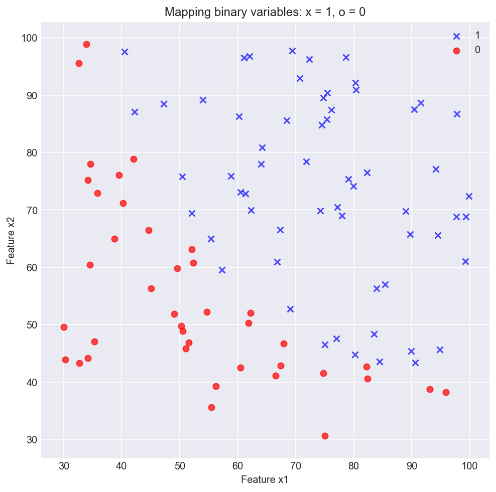 | 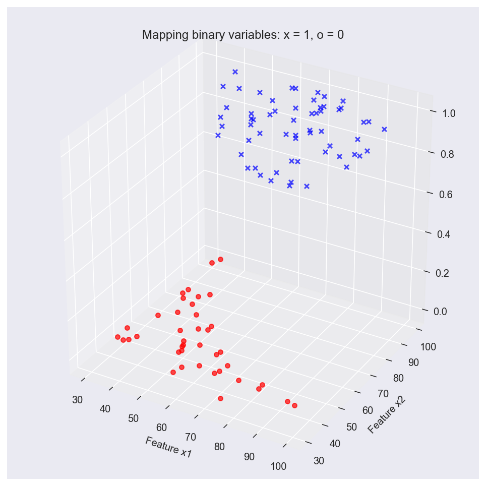 |

#### Hypothesis function

    The hypothesis function for normal linear regression is run through a non-linear function, g(z), the sigmoid function.


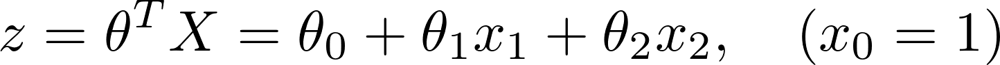

    The sigmoid/logistic function.


#### Cost function

    The loss function is calculated using the log of maximum likelihoodsand is dependent on the true value of y.

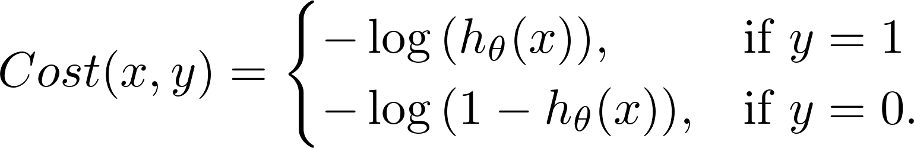

    When combined, the cost function can be expressed as:


    Vectorized cost function


#### Gradient descent

    The gradient algorithm is the similar to the one for linear regression.


    Vectorized Gradient descent


#### Loss curve and final boundary line using a linear function.

Here we use a linear function  to model our data. This is why our boundary line is a straight line which fits the data pretty well but we can clearly see that a polynomial model can fit the data better.

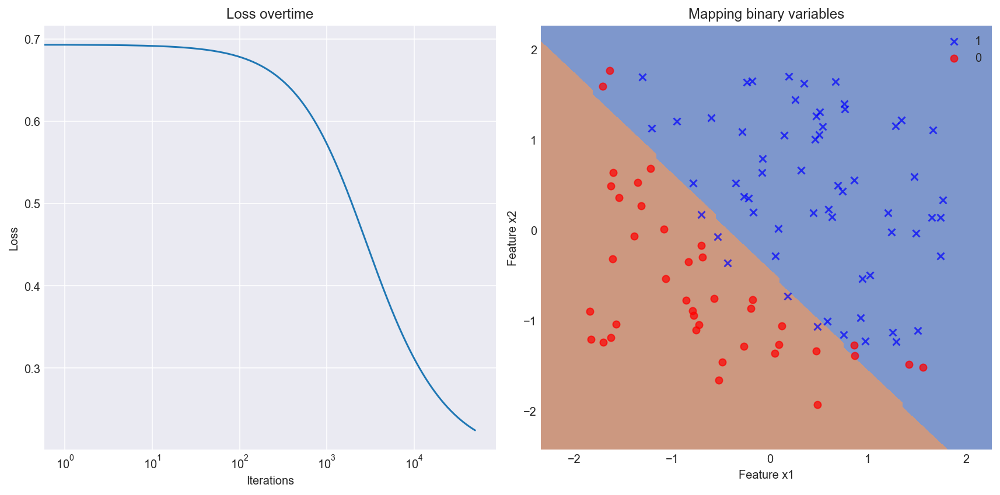

## Polynomial Logistic Regression

#### Loss curve and final boundary line using a polynomial function.

Here we use a polynomial hypothesis function 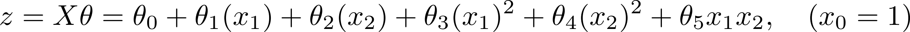 to model our data. Now our boundary line is a curved line which fits the data much better than the previous linear model.

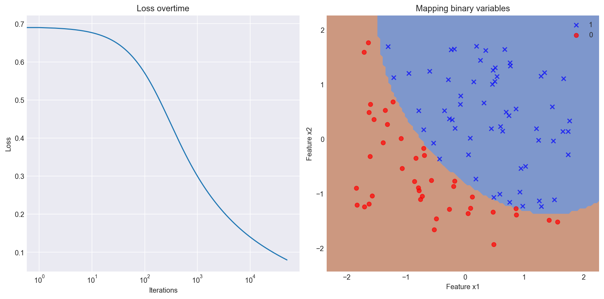

### Visualizing our third dataset.

|    2D representation   |    3D Representation   |
| :--------------------: | :--------------------: |
| 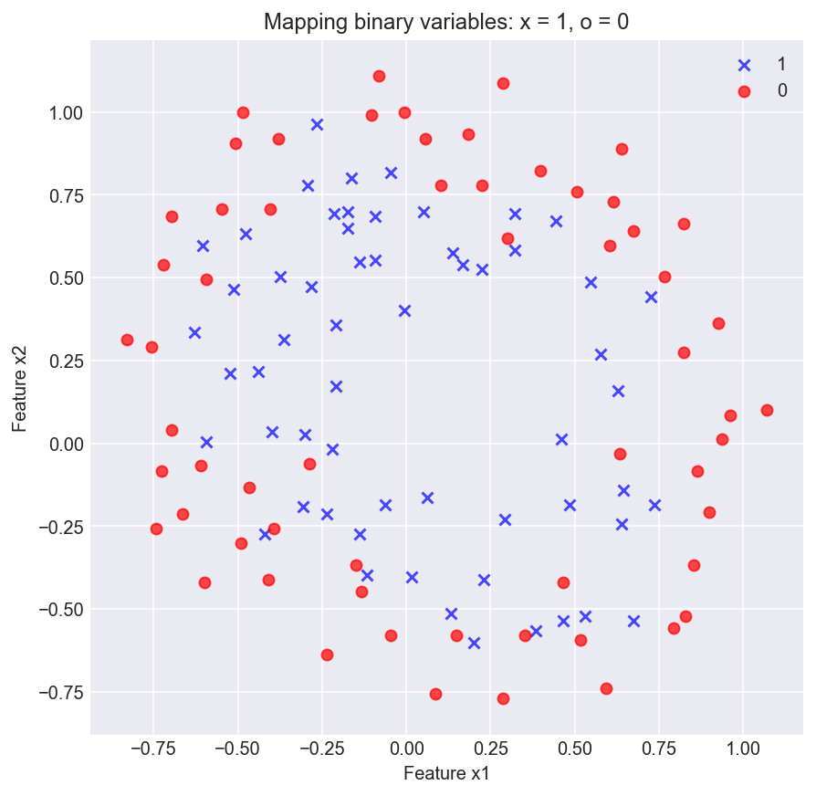 | 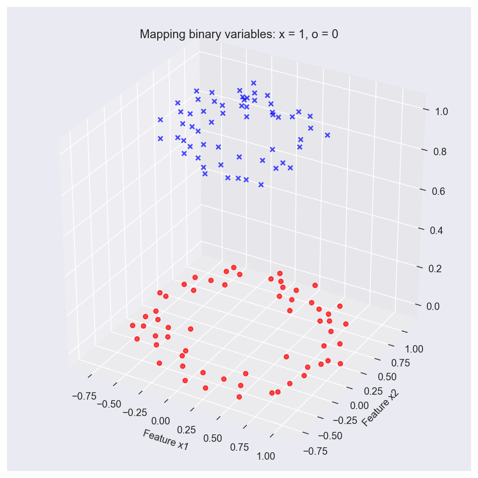 |

#### Hypothesis function


    The hypothesis function is a polynomial function of the second degree


#### Cost function

    We use the same cost function for logistic regression with polynomials.

<br/>
<br/>
<br/>


#### Gradient descent

<br/>

#### Vectorized Gradient descent


#### Loss curve and final boundary line using a polynomial function.

Here we use a polynomial function  to model our data.

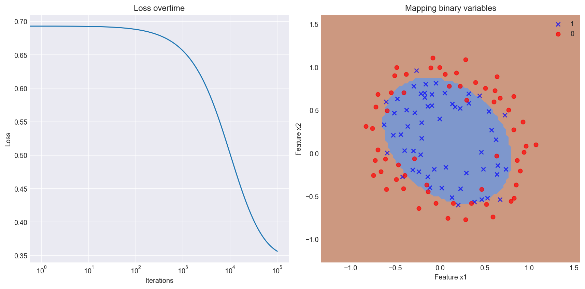

## Polynomial Logistic Regression with regularization

#### Loss curve and final boundary line using a polynomial function with regularization.

Here we use a polynomial function  to model our data.

#### Cost function with regularization

    The extra term adds regularization to our regression causing our parameters to decrease in magnitude.
    The constant lambda is the regularization factor. Too large of a lambda might cause underfitting.


    Vectorized Cost function with regularization


#### Gradient descent update

    We update the 0th parameter without regularization.


    Vectorized gradient descent has to be done in two steps.

Calculate the gradient without regularization and update the 0<sup>th</sup> bias parameter.

<br/>


Add regularization to the gradient and then update the rest of the parameters.

<br/>


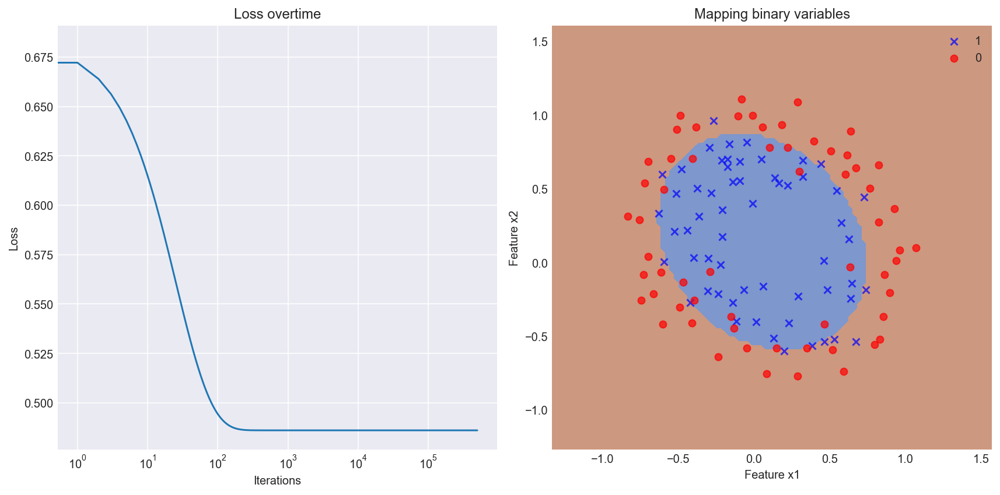

**We can observe that the loss for training set has not quite reached the same low levels as for the logistic regression without regularization. However, our model with regularization will be more generalizable with new unseen test examples.**

#### Important notes on Scaling

When creating training and testing sets, scaling must be done carefully:

-   The `scaling object` should be _fit_ on the `TRAINING` data
-   The `scaling object` can be used to _transform_ the `TRAINING` data now
-   The `transformed TRAIN` data can be used to the fit the predictive model
-   The same `scaling object` should be used to _transform_ the `TESTING` data
-   The predictive model can now bw used on the `transformed TEST` data to make predictions

Example with `sklearn`:

```python
from sklearn.preprocessing import MinMaxScaler

scaler = MinMaxScaler()
scaler.fit(X_train)
X_train_scaled = scaler.transform(X_train)
model.fit(X_train_scaled)
X_test_scaled = scaler.transform(X_test)
y_predicted = model.predict(X_test_scaled)
```

# Application of Linear and Logistic Regression on real world datasets

## Setup and Installation

Set up a python virtual env and install all python packages in `requirements.txt` and enable jupyer notebook nbextensions

```shell
$ pip install -r requirements.txt
$ pip install jupyter_contrib_nbextensions && jupyter contrib nbextension install
$ jupyter nbextension enable --py widgetsnbextension
```

## Linear Regression

### Boston Housing Prices Dataset

We use a classic linear regression model using the closed form or the normal equation solution to train our model. The error is measured with the Mean Squared Error function.

We also use a ridge regression model with k-fold cross validation to report the most optimal parameters for training the model.

**Results summarized**

All regressions run with a KFoldCrossValidator with 10 folds

Linear regression with no regularization (lambda = 0):

-   Average train loss was: `10.899187765195178`
-   Average test loss was: `11.887818544342881`
-   R squared for the entire dataset was `0.7402547552453309`

For ridge regression, a lambda of 10 yields the best results quantified by the minimum test error:

-   Average train loss was: `11.56861911239611`
-   Average test loss was: `14.642007589269346`
-   R squared for the entire dataset was `0.7308523643988569`

For Polynomial regression with second degree features, a lambda of 10.0 yields the minimum testing error:

-   Average train loss is: `3.569900140898917`
-   Average test loss is: `8.642765610683222`
-   R squared for the entire dataset was `0.9159867990609393`

#### Running the notebook

Use jupyter notebook to run `notebooks/linear_regr_boston_housing_dataset.ipynb`

## Logistic Regression

### Wisconsin Breast Cancer Dataset

We use a logistic regression model with log likelihood loss as the optimization function with gradient descent.

The loss visualized on every 100 iteration of the gradient descent

**Results summarized:**

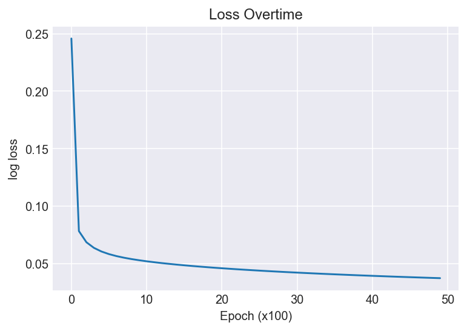

-   The accuracy of the model was 0.9736842105263158

-   The precision of the model was  0.9930555555555556

-   The recall of the model was  0.9662162162162162

-   The f1 score of the model was  0.9794520547945206

The confusion matrix from the model:

    			                 Actual values
    			             Positive(1)   Negative(0)
    Predicted | Positive(1)     TP 143	  FP 1
      Values  | Negative(0)     FN 5		TN 79

#### Running the notebook

Use jupyter notebook to run `notebooks/logistic_regr_breast_cancer_wisconsin_dataset.ipynb`

## Acknowledgements and Data Sources

-   Harrison, D. and Rubinfeld, D.L. \`Hedonic prices and the demand for clean air\\', J. Environ. Economics & Management, vol.5, 81-102, 1978.

-   Dua, D. and Graff, C. (2019). UCI Machine Learning Repository [http://archive.ics.uci.edu/ml]. Irvine, CA: University of California, School of Information and Computer Science.

-   Dataset from Andrew Ng Machine Learning Stanford edu MOOC.
