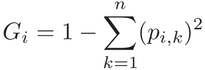
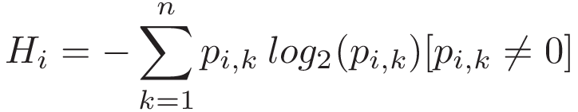
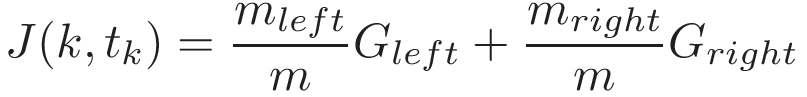

# Decision Trees

## Decision Tress Background

### Measures of Impurity

-   **Gini Impurity**

Where pi,k is the ratio of class k instances among the training instances in the ith node.

Decision trees using Gini Impurity tend to isolate most frequent classes in their own branch in the tree.

-   **Entropy Impurity**

Decision trees using Entropy Impurity create slightly more balanced trees compared to those using Gini Impurity.

### Training Algorithms

-   **CART**

CART Loss function uses `Gini Impurity`

Where k = single feature, tk = threshold.

Gleft/right is the Gini Impurity of the left/right subset

mleft/right is the number of instances in the left/right subset

-   **ID3**

ID3 uses `Entropy` measure and `information gain`.

The `Information Gain` is the difference in entropy before and after a set _S_ is split on an attribute _A_. Or, reduction of uncertainty in the set after splitting on attribute _A_.

## Preprocessing Data

The dataset used is the `sklearn iris` dataset. The X features matrix is normalized with min-max scaling and randonly shuffled.

## Decision Tree

Using 10 K-fold cross validation and different thresholds for minimum number of data in tree nodes we get the following results:

    When cutoff is 5 nodes, Average accuracy is 0.9467 and Standard deviation is 0.0499

    When cutoff is 10 nodes, Average accuracy is 0.9533 and Standard deviation is 0.0427

    When cutoff is 15 nodes, Average accuracy is 0.9467 and Standard deviation is 0.0718

    When cutoff is 20 nodes, Average accuracy is 0.9467 and Standard deviation is 0.0718

The results are as expected as we increase the number of minimum nodes, the decision tree overfits less on the training data. However, when we ge to 15 nodes, the model might be starting to underfit and we get a reduction in accuracy again.
