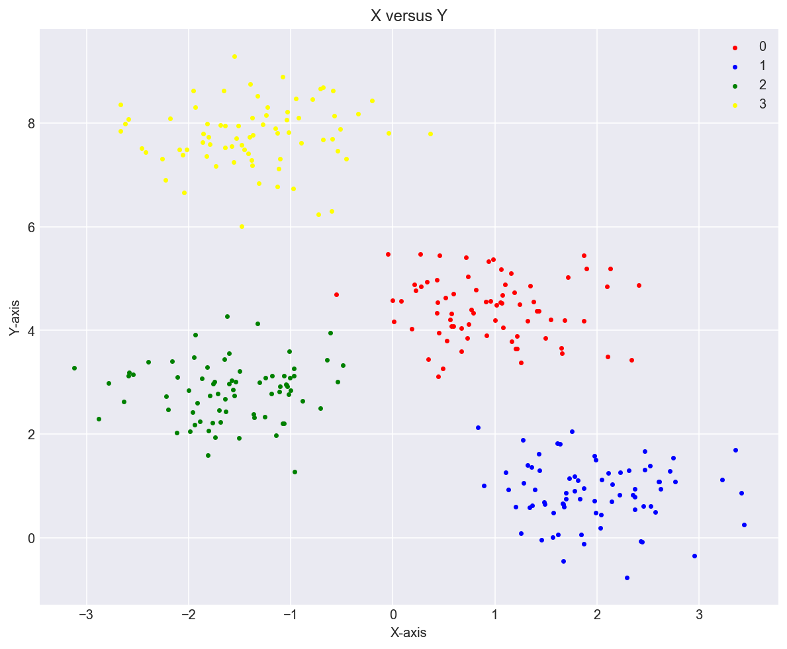
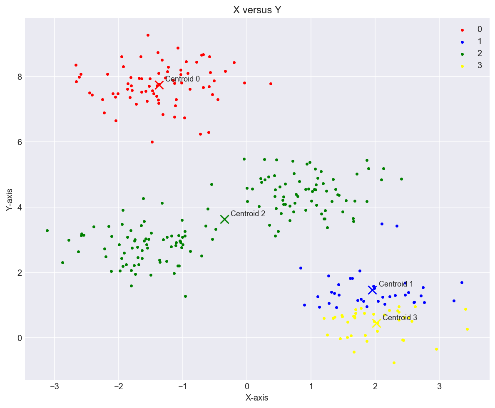
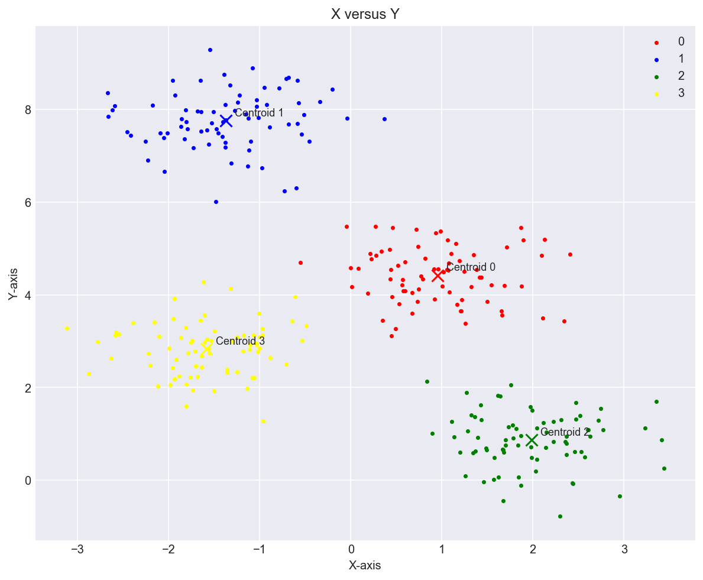
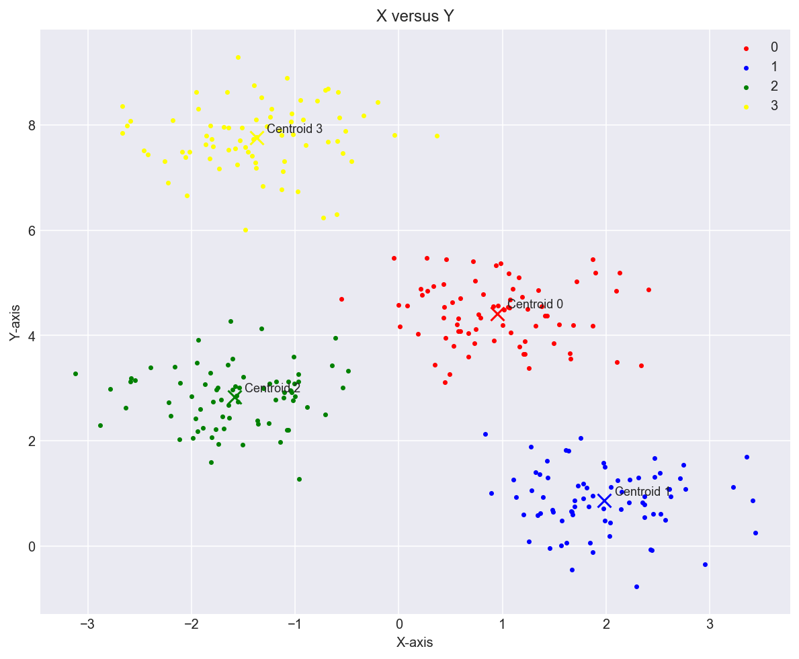
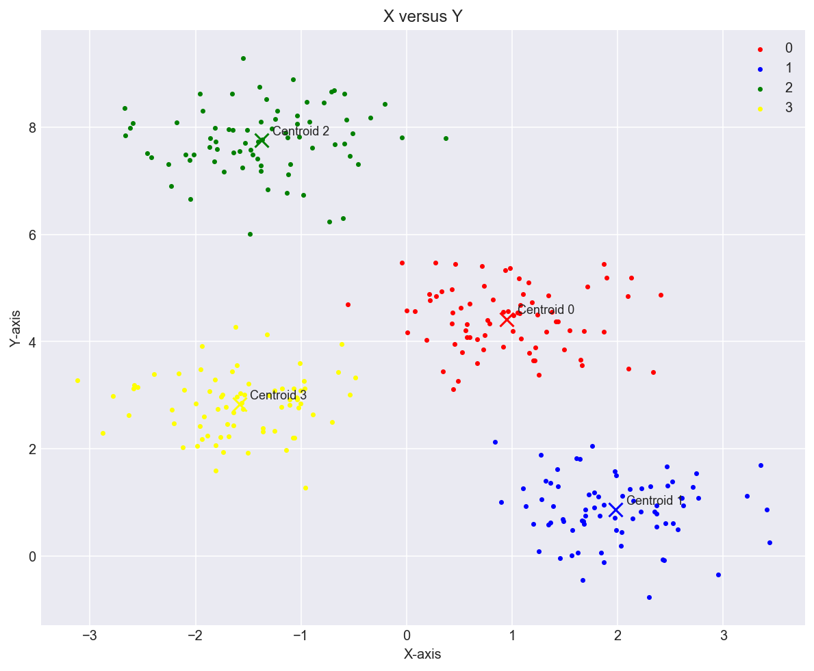
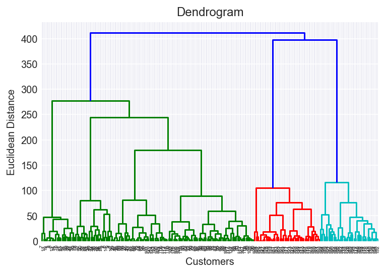

# Clustering Algorithms

## K-means and K-means plus plus Clustering

We use a artificially generated dataset using the `sklearn.datasets.makeblobs module` to create a distribution with four clear clusters.

Using the K-means clustering with a random seed of 0, we get the following clustering results:

Using the same K-means clustering with a random seed of 2, we get the following clustering results:

We observe a suboptimal clustering with a seed of 0 due to random chance, i.e. the initial clusters were chosen at such a location which caused the clustering algorithm to converge to suboptimal centroids as seen in the figure with a seed of 0.

To avoid this suboptimal positions of the group centroids, we implement a K-means plus plus optimal initial centroid selection algorithm.

**K-means plus plus Algorithm**

-   Choose one center uniformly at random from among the data points
-   For each data point x, compute D(x), the distance between x and the nearest center that has already been chosen
-   Choose one new data point at random as a new center, using a weighted probability distribution where a point x is chosen with probability proportional to D(x)^2
-   Repeat Steps 2 and 3 until k centers have been chosen
-   Now that the initial centers have been chosen, proceed using standard k-means clustering

Now, with a seed of 2, we get the following clustering results:

And with a seed of 0, we get the following clustering results;

## Hierarchical Clustering

-   Agglomerative Clustering
-   Divisive Clustering

**Agglomerative Clustering Algorithm**

-   Compute the proximity matrix
-   Let each data point be a cluster
-   Repeat: Merge the two closest clusters and update the proximity matrix
-   Until only a single cluster remains

To choose the apprirate value for the number of clusters, we can create a dendogram first.

Plotting our `Mall_Customers.csv` dataset after Agglomerative Clustering:

