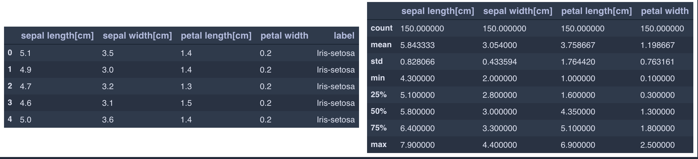
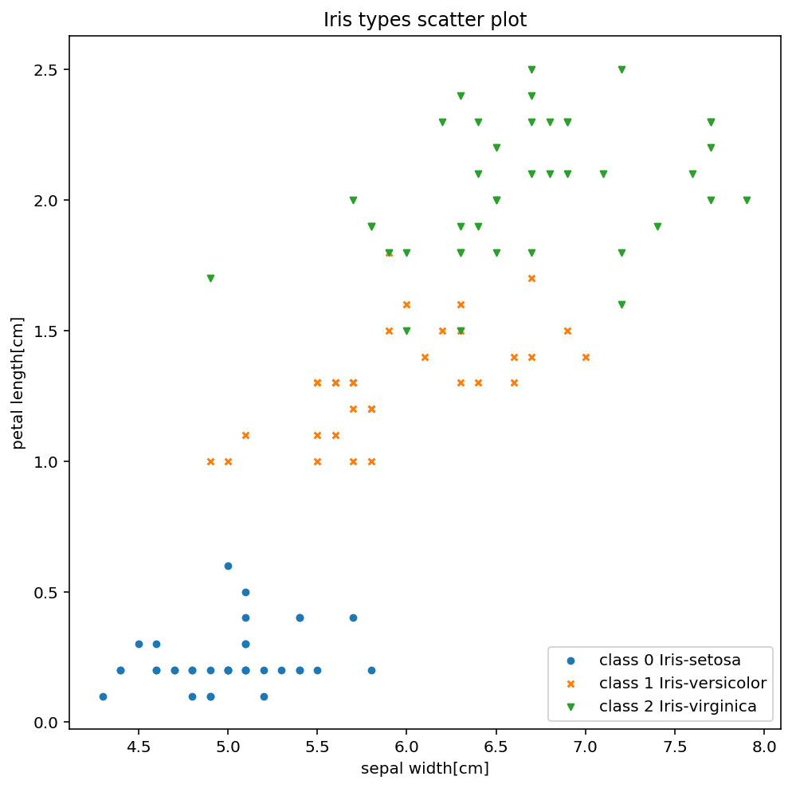

# K Nearest Neighbors

## EDA of the sklearn iris dataset

Observing the first five elements of our dataset and generating a statistical description of our dataset

We have `150` training samples with three unique labels (`Iris-setosa, Iris-versicolor, Iris-virginica`).

The dataset plotted with `sepal length[cm]` and `petal width` as the two axes.

### Data Preprocessing

We use `sklearn.model_selection.train_test_split` to generate X_train, y_train, X_test, y_test sets.

## K Nearest Neighbors with two features

We initialize a KNN model with the given distance metrics and different values for `k` for a dataset of only two features (`sepal length[cm]` and `petal width`) at first.

### Results

#### KNN with euclidean distance as the distance metric

    When k = 1,  accuracy = 0.9210526
    When k = 3,  accuracy = 0.9736842
    When k = 5,  accuracy = 0.9473684
    When k = 7,  accuracy = 0.9736842
    When k = 9,  accuracy = 0.9736842
    When k = 11, accuracy = 0.9736842

#### KNN with manhattan distance as the distance metric

    When k = 1,  accuracy = 0.9210526
    When k = 3,  accuracy = 0.9736842
    When k = 5,  accuracy = 0.9473684
    When k = 7,  accuracy = 0.9736842
    When k = 9,  accuracy = 0.9736842
    When k = 11, accuracy = 0.9473684

## K Nearest Neighbors with all four features

### Results

#### KNN with euclidean distance as the distance metric

    When k = 1,  accuracy = 1.0
    When k = 3,  accuracy = 1.0
    When k = 5,  accuracy = 1.0
    When k = 7,  accuracy = 1.0
    When k = 9,  accuracy = 1.0
    When k = 11, accuracy = 1.0

#### KNN with manhattan distance as the distance metric

    When k = 1,  accuracy = 1.0
    When k = 3,  accuracy = 1.0
    When k = 5,  accuracy = 1.0
    When k = 7,  accuracy = 1.0
    When k = 9,  accuracy = 1.0
    When k = 11, accuracy = 1.0
