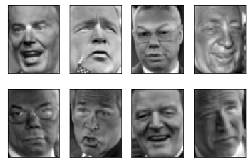
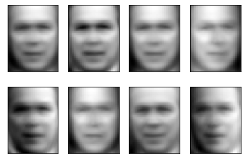
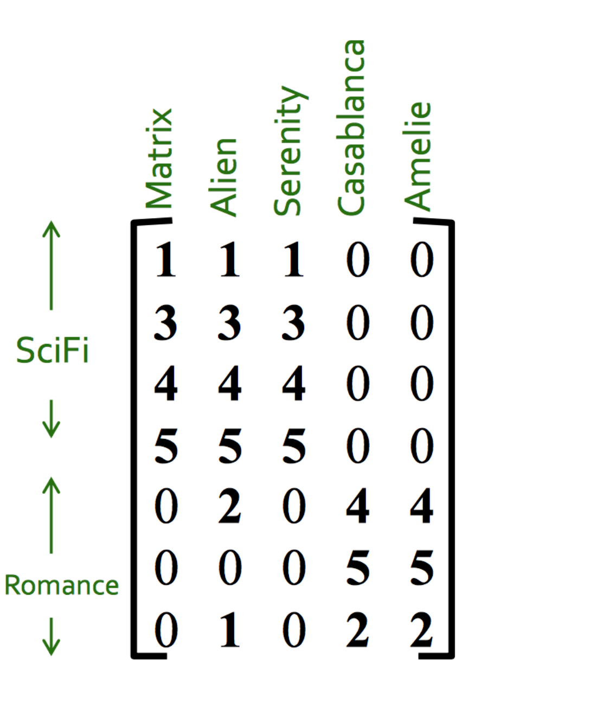
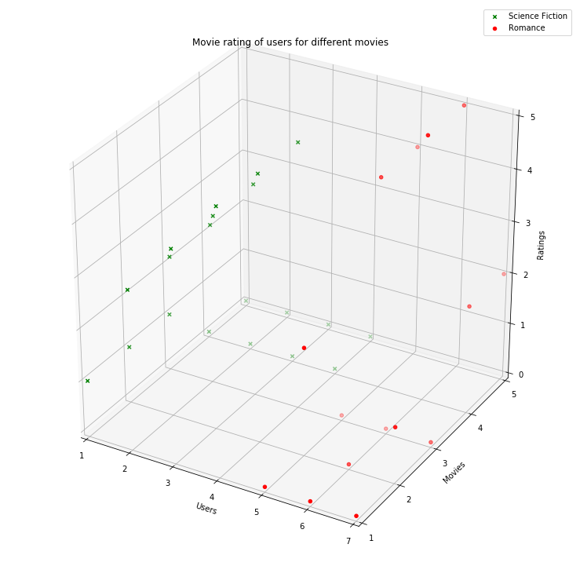
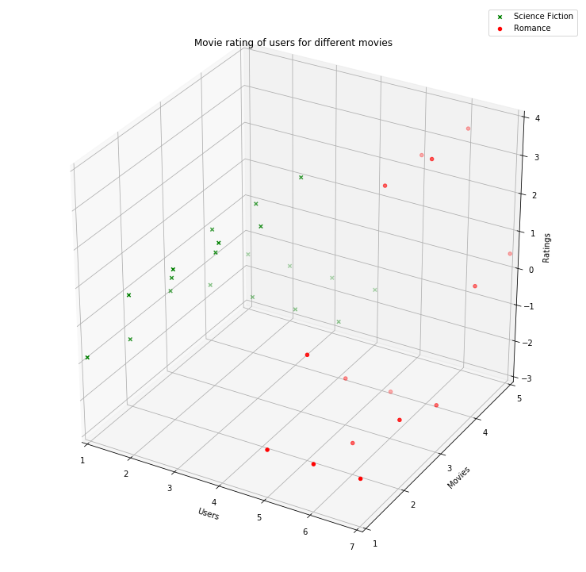
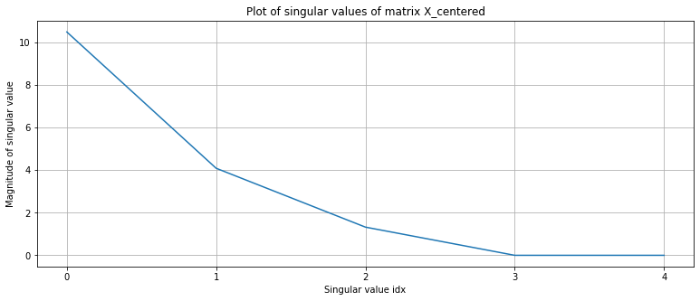
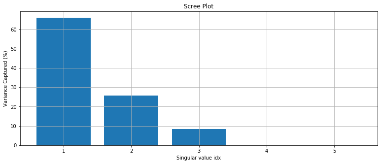
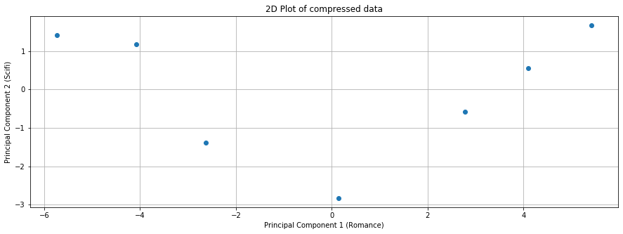

# Dimensionality reduction with PCA

## Example of PCA Dimensionality reduction and decompression

PCA Dimensionality reduction on the `sklearn.fetch_lfw_people` image dataset.

|   The original images   | Images with mean subtracted |
| :---------------------: | :-------------------------: |
|  |  |

After Dimensionality reduction and decompression.

|    Using 5 Principal Components    |    Using 50 Principal Components    |
| :--------------------------------: | :---------------------------------: |
|  |  |

## Dataset

We employ PCA for a tiny table acquired from [Stanford Dimensionality Reduction](http://web.stanford.edu/class/cs246/slides/06-dim_red.pdf).

Given the following data matrix:

Each row corresponds to the ratings submitted by a single user on a scale of `1` to `5` for each of the movies. Missing movie ratings are marked by a zero.

We can see that the movies are either **sci-fi** or **romance**
The individual movies that we start with can be considered to be 5 different dimensions themselves, but if we group them into two genres (sci-fi or romance), it becomes a compressed representation of our data.

We can therefore use PCA tp get a compressed representation of our data matrix to highlight this distinction.

|        The original data       |         Data Centered at 0         |
| :----------------------------: | :--------------------------------: |
|  |  |

## Singular Value Decomposition

Linear Algebra states that any matrix can be decomposed into three a matrix product of three matrices:

For any matrix X with dimensions `m x n`

    X = USV^T

Where the columns of `V` (rows of `V^T`) are the principal components of `X`. `U` and `V` are orthogonal matrices and `S` is a diagonal matrix where the diagonal entries are the _Singular Values_.

    X^TX=(USV^T)^T(USV^T) = (V^T)^T S^T U^T US V^T = VS^T U^T USV^T = VS^2 V^T (U^T U=I as U is orthogonal)

The principal components of the matrix `A=X^T X`, lie in the rows of matrix `V^T`.

By selecting the first `k` columns of `V`, we end up selecting the `v_1, v_2, ..., v_k` vectors.

To project the training matrix `X` down to `d` dimensions. `X_{d_proj} = X * W_d` where `W_d` is the matrix containing the first `d` columns of matrix `V`.

To retrieve the original data back after some compression loss. `X’= X_{d_proj} * W_d^T`  where `W_d^T` is the transpose of `W_d` (The matrix containing the first $d$ columns of matrix `V`.)

**Singular values obtained from SVD**

**Scree Plot generated from SVD**

The scree plot shows that using the first and the second principal components captures `66+25=90%` of the variance in our data, so two principal components capture a reasonable amount of information.

**Using only two principal components we get the following data**

## Eigenvectors and Eigenvalues from Covariance Matrix

Now we compute `V` (the eigenvectors), and the diagonal elements of `D` (the eigenvalues) from `A = X^T*X = V*D*V^T`

The covariance matrix data matrix, `X`, can be computed as  `1/N*X^T*X`.

If `X` is our data matrix comprising of `d` features. Then `X^TX` is a `(d * d)` symmetrix matrix wherein each entry at location **ij** corresponds to the scalar projection of **feature i** with **feature j**.

**Note:** The data matrix `X` must also be centered around the mean.
