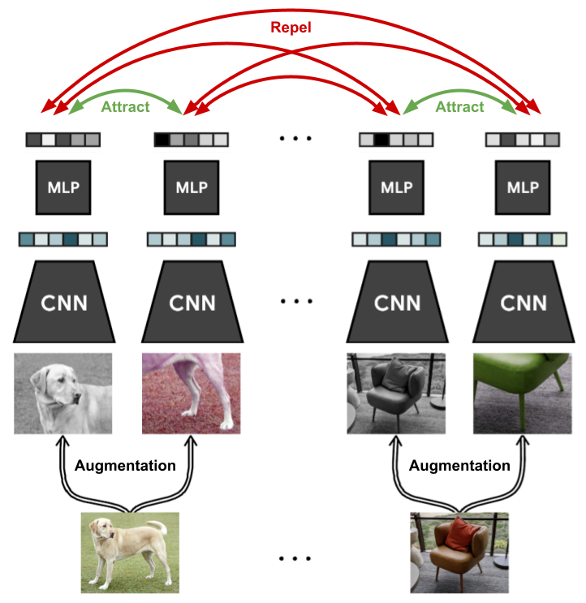

# Self-supervised contrastive learning with SimCLR

- [Self-supervised contrastive learning with SimCLR](#self-supervised-contrastive-learning-with-simclr)
  - [Data Augmentation](#data-augmentation)
  - [SimCLR Implementation](#simclr-implementation)
  - [SimCLR Loss](#simclr-loss)
  - [Reference](#reference)

In self-supervised learning, we use unlabeled data (Labels may be acquired from the data itself) to learn a representation that can be used to solve downstream tasks (e.g., classification).

Contrastive learning looks at how are images different from each other. It trains a model to cluster an image and its augmented version (Or other images of same class) together in latent space while maximizing the distance from other different images.

In SimCLR, we generate two augmented versions of each image in a batch and train a model to minimize distance between the two augmented versions of the same images and maximize distance between the augmented versions of all the different images in the batch. (Can have more than two augmented versions but two is the most efficient)

## Data Augmentation

The choice of the data augmentation to use is the most crucial hyperparameter in SimCLR since it directly affects the latent space structure, and patterns learned from the data. E.g. augmentations: 

 -   Crop and Resize
 -   Crop, Resize, (and Flip)
 -   Color Distort (Drop)
 -   Color Distort (Jitter)
 -   Flip (Horizontal, Vertical)
 -   Rotate (90, 180, 270)
 -   Cutout
 -   Gaussian Blur
 -   Gaussian Noise
 -   Sobel filtering 

The most important augmentations are Crop and Resize and Color Distort, but only lead to strong performance if used together [https://arxiv.org/abs/2006.10029].   

Crop and Resize deals with two situations, a) where region A provides a local view of the cropped region B and b) where region C provides a neighboring view of the cropped region D. Situation a) teaches the model scale invariance to ensure regions A and B are closer in the latent space. Situation b) is more challenging teaches the model to recognize objects beyond its limited view. Without color distortion, the model can do shortcut learning utilizing a loophole where the different crops of the same image are similar in the color space. If there is no color jittering, the model might just learn the color histograms rather than more generalizable features like textures or shapes of the objects.

An example setup of SimCLR augmentations can include random horizontal flip, crop-and-resize, color distortion, random grayscale, and gaussian blur.

## SimCLR Implementation

For every image $x$, we generate two differently augmented versions $x_i$ and $x_j$ and feed them to the feat. extraction network $f(.)$ and MLP projection head $g(.)$. The network outputs two embeddings $h_i$ and $h_j$ which are fed to the MLP head to get 1D vectors $z_i$ and $z_j$ whose similarity is maximized which increasing distance from all other vectors in the batch. The loss function is the negative cosine similarity between the two embeddings:

After training, the MLP is discarded and the feature extractor $f(.)$ is used to extract features from images and paried with a linear classifier head for when finetuning for downstream tasks. THe vectors $z$ from the MLP head show poorer results for new tasks as they hvae been trained to be color invariant which is required for other tasks.

## SimCLR Loss

SimCLR uses the InfoNCE, proposed by [Aaron van den Oord et al.](https://arxiv.org/abs/1807.03748), which compares the similarrity of $z_i$ and $z_j$ to the similarity of $z_i$ and any other augmented representation in the batch by doing a softmax over the similarity values.

$\ell_{i,j}=-\log \frac{\exp(\text{sim}(z_i,z_j)/\tau)}{\sum_{k=1}^{2N}\mathbb{1}_{[k\neq i]}\exp(\text{sim}(z_i,z_k)/\tau)}=-\text{sim}(z_i,z_j)/\tau+\log\left[\sum_{k=1}^{2N}\mathbb{1}_{[k\neq i]}\exp(\text{sim}(z_i,z_k)/\tau)\right]$

$\tau$ is a hyperparameter, called temperature, that determines how peaked the distribution. The similarity metric is the cosine similarity:

$\text{sim}(z_i,z_j) = \frac{z_i^\top \cdot z_j}{||z_i||\cdot||z_j||}$

## Reference

-   [SimCLR Tutorial Notebook](https://uvadlc-notebooks.readthedocs.io/en/latest/tutorial_notebooks/tutorial17/SimCLR.html)