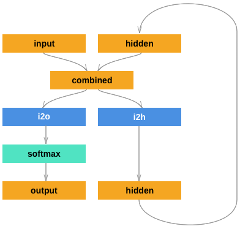
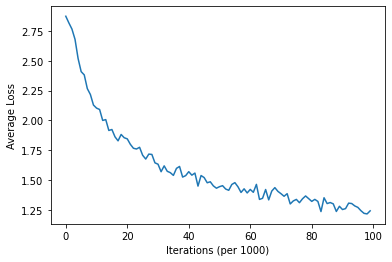
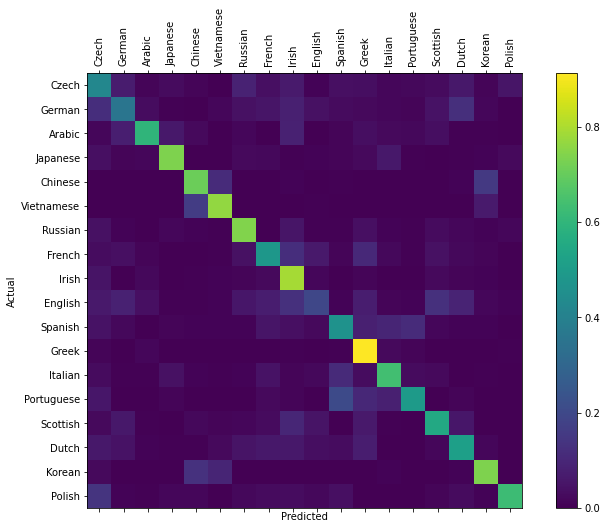

# Recurrent Neural Networks

-   [Simple RNN](#simple-rnn)
-   [LSTM](#long-short-term-memory)

## Simple RNN

An implementation of RNNs using PyTorch for a simple name-to-language classification task

### Data

The language to names data can be downloaded [here](https://download.pytorch.org/tutorial/data.zip) and is also available in the `data` directory.

### Model

(Source <https://pytorch.org/tutorials/intermediate/char_rnn_classification_tutorial.html>)

### Training

Network is trained for 100000 iterations on random generations of data points with a lr of 0.0056

### Results

We get an accuracy of 58% on the complete dataset using this network and training scheme.

Confusion matrix on 10000 randomly selected points from dataset (Without replacement)

## Long Short Term Memory

An improvement on the Simple RNN architecture to allow the NN to remember past information for longer sequences and not as prone to vanishing/exploding gradient problem in Simple RNNs.

#### Acknowledgement

-   [Official PyTorch Tutorial](https://pytorch.org/tutorials/intermediate/char_rnn_classification_tutorial.html)
