# Neural Network simple implementation

A simple implementation of a neural network in python. This is not how actual neural networks are implemented and this is an example for only learning purposes.

## Neuron

A neuron is a component of machine learning that takes _n_ inputs, does math with the inputs and outputs a single value.

Simple neuron with two inputs.

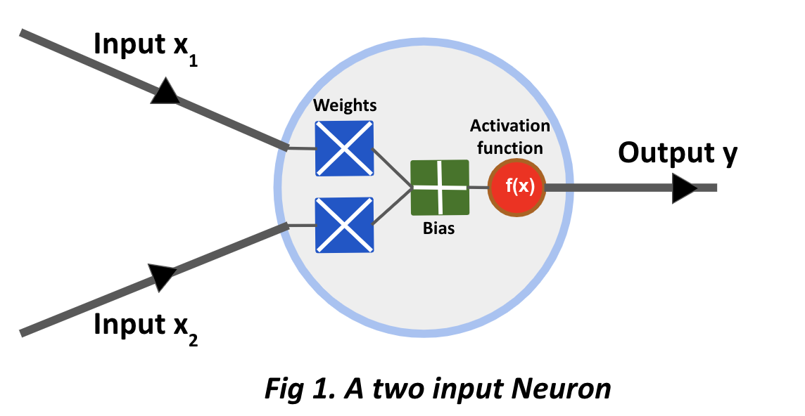

Inputs x<sub>1</sub> and x<sub>2</sub>, multiplied by weights w<sub>1</sub> and w<sub>2</sub>.

    x1:-> x1 * w1
    x2:-> x2 * w2

Weighted inputs added together with a bias `b`. Then the sum is passed through an activation function, `y=ƒ(x1 * w1 + x2 * w2 + b)`.

The activation function turns an unbounded input into a useful predictable form. It compresses inputs in the domain (-∞, 	+∞) to (0, 1). Large negative numbers become ~0 while large positive numbers become ~1.

One example of the activation function is the **sigmoid function**. ƒ(x) = 1⁄<sub>(1+e<sup>-x</sup>)</sub>. The **logit function** ƒ(x) = ln( <sup>p</sup>⁄<sub>(1-p)</sub> ) is the inverse of the sigmoid function. It maps the probabilties in the range (\[0, 1]) to R ((-∞, +∞)).

## 1) An instance of a two input neuron

A two input neuron with weight, _w_=\[2,0] and bias _b_=3. And an input of \[3,4].

Using the dot product for concise computation.

    (w.x) + b = ((w1 * x1)+(w2 * x2)) + b
              = (6+0)+3
              = 9

            y = ƒ((w.x)+b) = f(9) = 0.999

The **logit** of the neuron is equal to the dot product of the input and weights vector added to the bias. (This is different from the logit function discussed above)

The process of passing inputs forward to get an output is called a **feedforward**.

```python
import numpy as np
# A simple two input neuron example

def sigmoid(x):
  return 1/(1+np.exp(-x))

class Neuron:
  '''Simple two input neuron class'''
  def __init__(self, weights, bias):
    self.weights = weights
    self.bias = bias

  def feedforward(inputs):
    '''weights and input array must have same dimensions'''
    si = np.dot(self.weights, inputs) + self.bias
    return sigmoid(si)

weights = np.array([3,4,0,2,4])
bias = -6
inputs = np.array([1,3,2,1,1])

n1 = Neuron(weights, bias)
n1.feedforward(inputs) # 0.999999694097773
```

## 2) A neural network

It a collection of neurons that are connected together. A **Deep Neural Network** is a network with multiple hidden layers.


A **hidden layer** is any layer that is between the input (first) layer and output (last) layer.

```python
# Using the same implementation of Neuron class and sigmoid function from above
class NeuralNetwork:
  def __init__(self, weights, bias):
    self.h1 = Neuron(weights, bias)
    self.h2 = Neuron(weights, bias)
    self.o1 = Neuron(weights, bias)

  def feedforward(self, inputs):
    out_h1 = self.h1.feedforward(inputs)
    out_h2 = self.h2.feedforward(inputs)

    out_o1 = self.o1.feedforward(np.array[out_h1, out_h2])
    return out_o1

net1 = NeuralNetwork([0, 1], 0)
inpt = np.array([2, 3])
net1.feedforward(inpt) # 0.7216325609518421
```

## 3) Training a neural network (Mean Squared Error)

Given the following measurements:

| No. | height | weight | age | gender |
| :-: | :----: | :----: | :-: | :----: |
|  1  |   151  |   47   |  63 |    m   |
|  2  |   139  |   36   |  63 |    f   |
|  3  |   136  |   31   |  65 |    f   |
|  4  |   156  |   53   |  41 |    m   |
|  5  |   145  |   41   |  51 |    f   |
|  6  |   163  |   62   |  35 |    m   |

We want our neural network to predict the gender based on the height and weight of the individual first.

Truncating the heights, weights, and ages by their arithmetic means for easier calculation. While males are represented with `1` and females as `0`.

| No. | height (reduce 48) | weight (reduce 45) | age (reduce 53) | gender |
| :-: | :----------------: | :----------------: | :-------------: | :----: |
|  1  |         103        |          2         |        10       |    1   |
|  2  |         91         |         -9         |        10       |    0   |
|  3  |         88         |         -14        |        12       |    0   |
|  4  |         108        |         -8         |       -12       |    1   |
|  5  |         97         |         -4         |        -2       |    0   |
|  6  |         115        |         17         |       -18       |    1   |

### Loss/Cost

The quantification of the performance measure of a model based on a function known as the **cost or loss** function.

Using the **Mean Square Error (MSE)** loss function:

<sub>Note that we use <sup>1</sup>⁄<sub>n</sub> instead of <sup>1</sup>⁄<sub>2n</sub> as seen with similar MSE loss functions in linear regressions as the <sup>1</sup>⁄<sub>2</sub> term is a constant which does not matter here as we are optimizing/minimizing this function over other parameters like the weights and biases of the neuron. The squared power term is also a constant so we can actually use any multiple of 2 greater than 2 as the power. </sub>

<p align="center">
    
</p>

Here,

-   _n_ is the total number of samples.
-   _y_ is the predicted variable that is the gender of the individual.
-   _y<sub>true</sub>_ is the actual Gender while _y<sub>pred</sub>_ is the predicted gender of the individual.
-   **Error** = _y<sub>true</sub>_ - _y<sub>pred</sub>_

The **MSE** is mean of all the squared errors for each sample. The smaller the loss, the better the ML model.

**Training a neural network** refers to reducing this loss or minimizing the _loss/cost function_.

### Example of loss calculation

Given the following values:

| No. | _y<sub>true</sub>_ | _y<sub>pred</sub>_ |
| :-: | :----------------: | :----------------: |
|  1  |          1         |          1         |
|  2  |          0         |          1         |
|  3  |          0         |          0         |
|  4  |          1         |          1         |
|  5  |          0         |          0         |
|  6  |          1         |          1         |

<!--$$MSE = \frac{1}{6} (0+1+0+0+0+0) = 0.166 $$-->

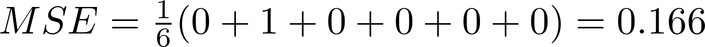

### Calculating MSE loss

```python
def mse(y_true, y_pred):
    ''' y_true and y_predict are numpy arrays,
    which represent the true and predicted values
    '''
    return ((y_true - y_pred)**2).mean()

y_true = np.array([1,0,0,1,0,1])
y_pred = np.array([1,1,0,1,0,1])
mse(y_true, y_pred) # 0.166
```

## 4) Training a complete neural network

If we just look at sample 1 from our data.

| No. | height (reduce 48) | weight (reduce 45) | age (reduce 53) | gender |
| :-: | :----------------: | :----------------: | :-------------: | :----: |
|  1  |         103        |          2         |        10       |    1   |

Here, calculating the MSE

<!-- $ \frac {1} {1} \sum_{i=1}^{1} (y_{true} - y_{pred})^2 $ -->

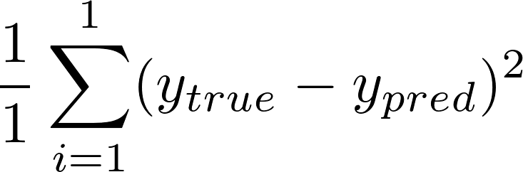

<!-- $ L = (1-y_{pred})^2 $ -->

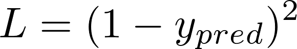

The loss of a function can also be represented as function of weights and biases of the neurons involved.


Now, loss can be represented as a multivariate function,

<!-- $L (w1, w2,  w3, w4, w5, w6, b1, b2, b3)$ -->

<center>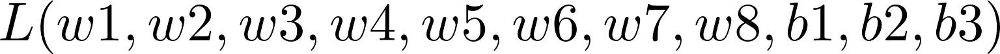</center>
</br>

Now, to minimize this loss function we have to observe how _L_ might change when one of its parameters, such as _w1_ is changed. For these calculations we can make use of the **partial derivate**, <sup>_∂L_ </sup>⁄<sub> _∂w<sub>1</sub>_</sub>.

We can rewrite this partial derivative in terms of <sup>_∂y<sub>pred</sub>_ </sup>⁄<sub> _∂w<sub>1</sub>_</sub> like:

<center>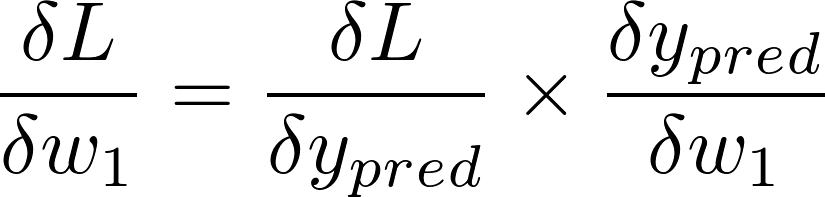</center>

We calculated that _L_ = ( 1 - _y<sub>pred</sub>_ )<sup>2</sup>, so:

<center>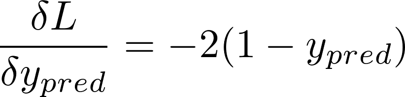</center>
</br>

To calculate  <sup>_∂y<sub>pred</sub>_  </sup>⁄<sub> _∂w<sub>1</sub>_</sub>, given that _h1, h2_, and _o2_ represent the outputs of the respective neurons,the final output:

_y<sub>pred</sub>_ = _o<sub>1</sub>_ = ƒ( _w<sub>7</sub>.h<sub>1</sub>_ + _w<sub>8</sub>.h<sub>2</sub>_ + _b<sub>3</sub>_ )
where ƒ represents the sigmoid function. So:

<center>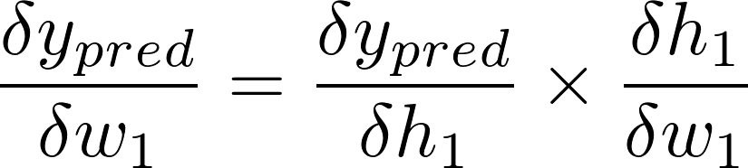</center>
<br/>
<center>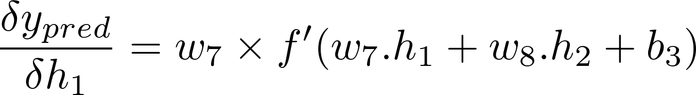</center>
<br/>

This method of using the _chain rule_ recursively is known as **back propagation**.
Now, doing the same back propagation calculation for <sup>_∂h<sub>1</sub>_  </sup>⁄<sub> _∂w<sub>1</sub>_</sub> :</br></br>

<center>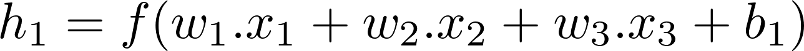</center>
<br/>
<center>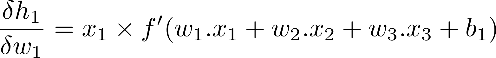</center>
<br/>

Here, _x<sub>1</sub>_ is the height, _x<sub>2</sub>_ is weight and _x<sub>3</sub>_ is the age. _ƒ<sup>'</sup>( x )_ is the derivate of the sigmoid function:

<center>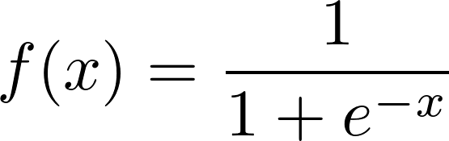</center>
</br>
<center>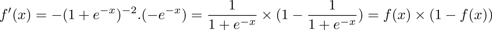</center>
</br>

Finally we can calculate <sup>_∂L_ </sup>⁄<sub> _∂w<sub>1</sub>_</sub> using the following equation:</br></br>

<center>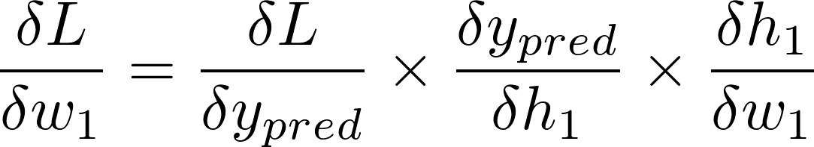</center>

### Example calculation of the partial derivative

| No. | height (reduce 48) | weight (reduce 45) | age (reduce 53) | gender |
| :-: | :----------------: | :----------------: | :-------------: | :----: |
|  1  |         103        |          2         |        10       |    1   |

Assuming there is a single row in our dataset and initializing all weights to 1 and all biases to 0:

    h1 = ƒ( w1x1 + w2x2 + w3x3 + b1)
       = f ( 103 + 2 + 10 + 0 )
       = 0.99999999999999

    h2 = ƒ( w4x1 + w5x2 + w6x3 + b2) = 0.99999999999999

    o1 = ƒ( w7h1 + w8h2 + b3)
       = ƒ( 0.99999999999999 + 0.99999999999999 + 0 )
       = 0.88

The neural network predicts that _y<sub>pred</sub>_ = 0.88, which is close to the true value 1(male) but not exactly 1.

Now, if we calculate <sup>_∂L_ </sup>⁄<sub> _∂w<sub>1</sub>_</sub> :


</br></br>

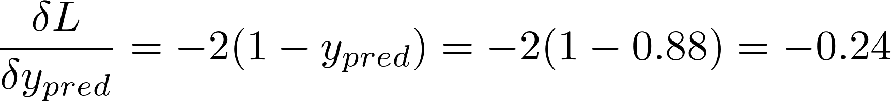
</br></br>

</br>
= 1 \* ƒ<sup>'</sup>(0.9999999 + 0.9999999 + 0)
</br>
= ƒ(1.9999999) \*  (1 - ƒ(1.9999999))
</br>
= 0.105
</br></br>

</br>
= 103 \* ƒ<sup>'</sup>(103 + 2 + 10 + 0)
</br>
= 103 \* ƒ(115)  \* (1 - ƒ(115))
</br>
= 0.0000000000001
</br></br>

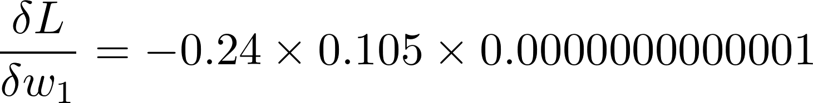</br>
= **-2.52e-15**

The negative partial derivative states that increasing _w<sub>1</sub>_ would decrease _L_ by a tiny fraction.

### Stochastic Gradient Training

The problem of fine tuning the weights and biases so as to minimize the function _L_ is an optimization problem. We can use an algorithm called **stochastic gradient descent (SGD)** for this. In SGD, the weights of the network are updated every time a single training example is processed compared to **Batch gradient descent (BGD)** where the weights are only updated once an epoch or all the training examples have been iterated once.

SGD is just the following update equation:

<center>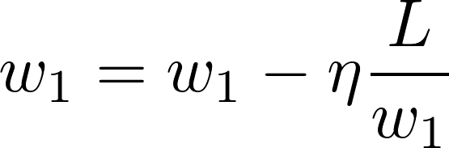</center></br>

_η_ is a constant known as the **learning rate** that controls how fast we train our network. Choosing a big _η_ might cause our model to overshoot the minima of the cost function and swing around it forever. Choosing too small of a value for _η_ might cause our partial derivative slope to never reach this minima.

-   If <sup>_∂L_ </sup>⁄<sub> _∂w<sub>1</sub>_</sub> is negative, <sub> _∂w<sub>1</sub>_</sub> will be increased which will reduce _L_.
-   If <sup>_∂L_ </sup>⁄<sub> _∂w<sub>1</sub>_</sub> is positive, <sub> _∂w<sub>1</sub>_</sub> will be decreased which will reduce _L_.

This process has to be repeated for each weight and bias in our network. This way our loss will slowly decrease and our network will improve.

#### Network Training Process

1.  Choose **one** sample from our dataset. As Stochastic Gradient Descent works on one sample at a time.
2.  Calculate all the partial derivates of the loss with respect to all the weights and biases. (e.g. <sup>_∂L_ </sup>⁄<sub> _∂w<sub>1</sub>_</sub>)
3.  Use the SGD update equation to update each weight and bias.

## Acknowledgments

-   Based on Victor Zhou's implementation at <https://victorzhou.com/blog/intro-to-neural-networks/>
