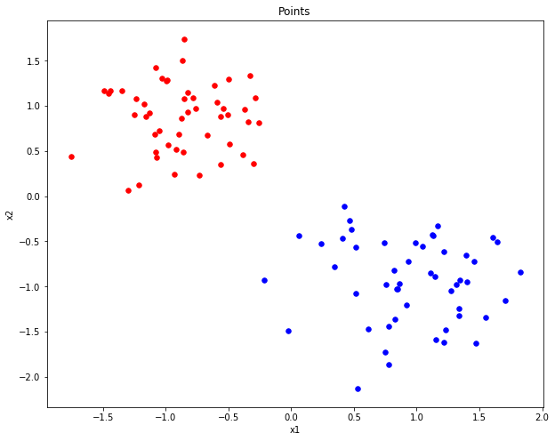

# Support Vector Machines

SVMs can be used for both regression and classification tasks. But it is widely used in classification objectives. The objective of the support vector machine algorithm is to find a hyperplane in an N-dimensional space (N — the number of features) that distinctly classifies the data points. To separate the two classes of data points, there are many possible hyperplanes that could be chosen. Our objective is to find a plane that has the maximum margin between the two classes.

## Data

We use a synthetic dataset. “X.csv” contains the information for all the instances and “y.csv” has labels corresponding to each instance in “X.csv”. For each instance, there are two attributes and there are total 100 instances.

  

## Hard Margin Case

For our current dataset, we use the hard margin classifier since all the instances of the data are linearly separable with no outliers.

We use the `cvxopt` python library to solve the primal problem for the SVM. After running the SVC on our dataset, we get the following decision boundary.

  

## References

-   Cortes, Corinna, and Vladimir Vapnik. “Support-Vector Networks.” Machine Learning 20, no. 3 (September 1995): 273–97. <https://doi.org/10.1007/BF00994018>.
